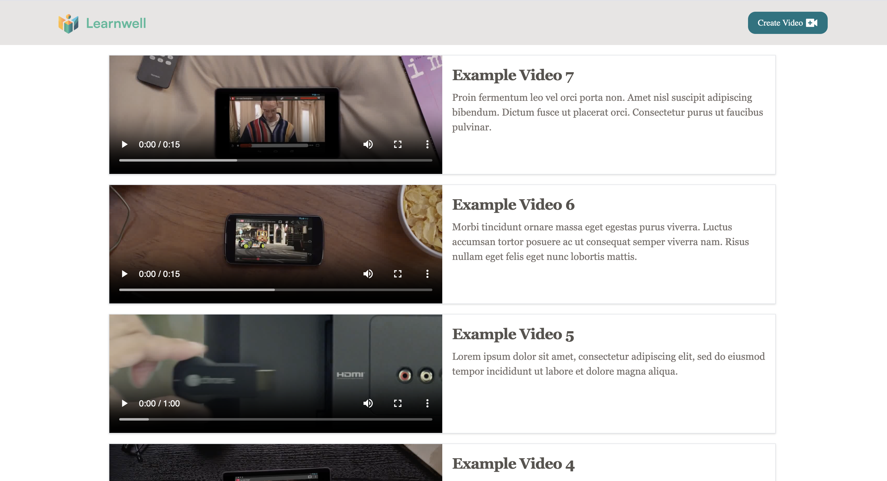
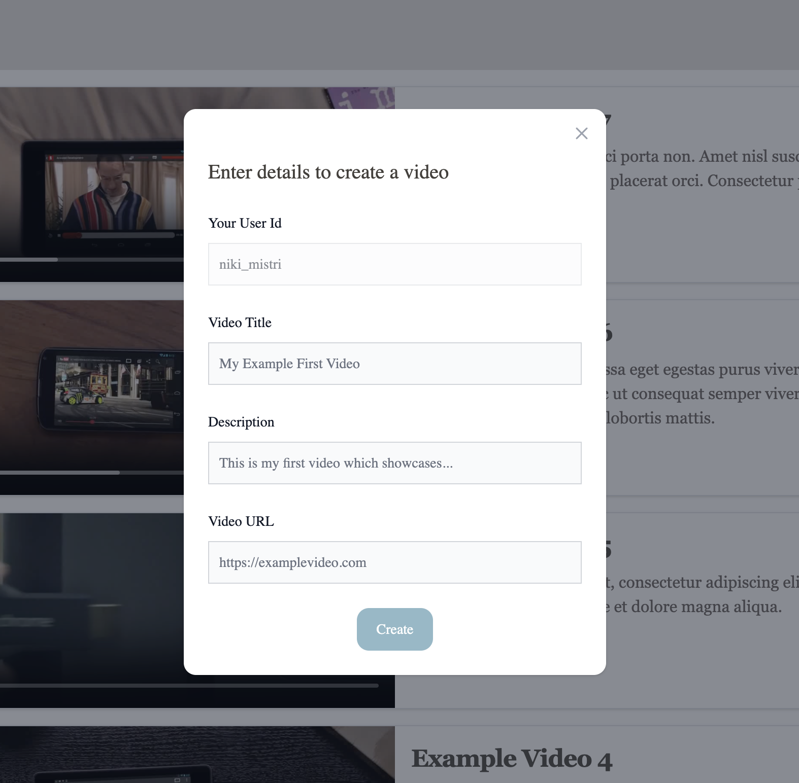
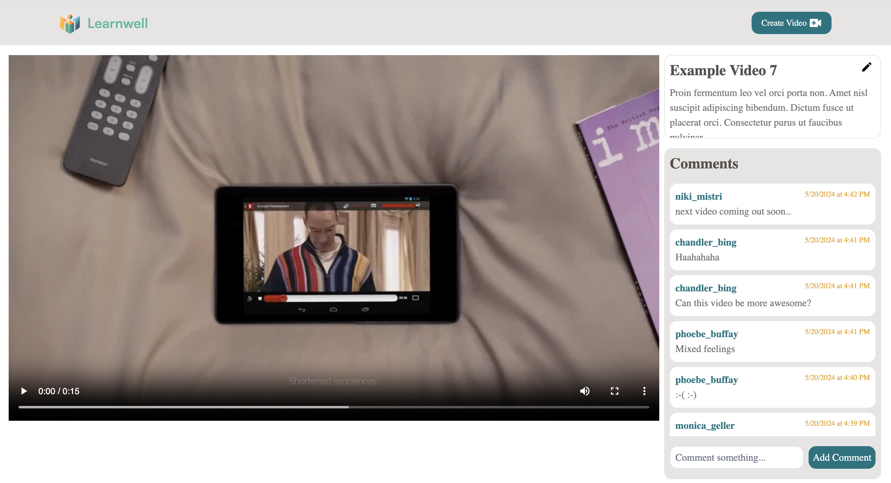
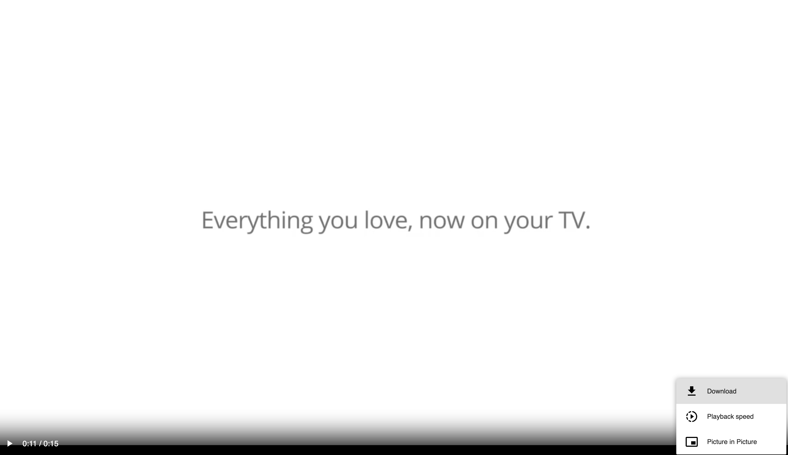

## To run this application

In the project directory, you can run:

### `npm install`

### `npm start`

Runs the app in the development mode.\
Open [http://localhost:3000](http://localhost:3000) to view it in your browser.

## Video Demo

https://drive.google.com/file/d/1WaaJWfMhc0XE-ym2I73Nplj6UEWssK5Q/view?usp=drive_link

### Screenshots

## Walkthrough of implementation

Framework : React
Styling: Tailwind CSS
#### user_id used for demo : niki_mistri

- Session storage is used to store user_id
- Based on user_id, videos are retrieved from the backend that belong to that user and displayed on home page.
- Each video is VideoCard component
- React routing is used to open VideoPage based on video's ID and video state is passed.
- Based on the video_id, details like comments, title, description are fetched from backend.
